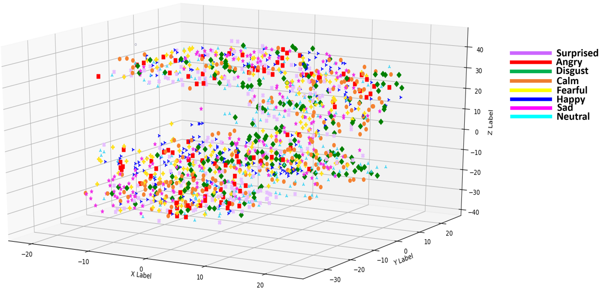
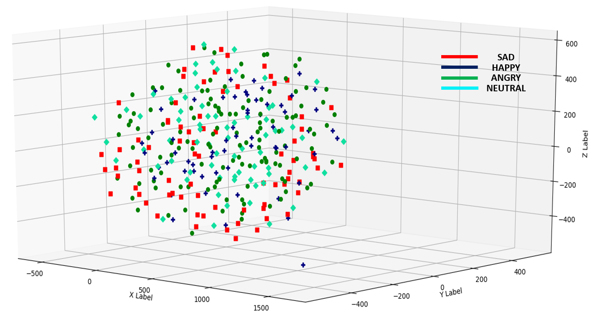

# 🎸 EmoSpeech: Emotion Detection From Audio Signal
In my internship, I've conducted research on audio signal analysis and applied couple of ML algorithms on two well-known dataset for audio emotion detection. 

##  📑 Dataset
Two datasets have been used to train different models.
 - [RAVDESS Dataset](https://zenodo.org/record/1188976#.XQq00LwzZPY)
 - [BERLIN Dataset](http://emodb.bilderbar.info/start.html) 

### 🌴 RAVDESS 
This is an english audio-visual DB created by Steven R.Livingstone and Frank A. Russo. For training, I've created **8** folders each corresponds to specific emotion. The folders contains audio files in following manner:

|Emotional Condition | Samples | 
:------------------:|:--------:|
Neutral | 96 |
Angry | 192 |
Happy | 192 |
Sad | 192 |
Calm | 192 |
Fearful | 192 |
Disgust | 192 |
Surprised | 192 |
  
### 🌴 Berlin DB
Berlin dataset contains audio samples in **Deutsch** language. Training samples are labeled as:

Emotional Condition | Samples | 
:------------------:|:--------:|
Neutral | 79 |
Angry | 127 |
Happy | 71 |
Sad | 62 |

## 💫 3D Feature Embedding
✔️ **RAVDESS**: The RAVDESS database is gender balanced consisting of 24 professional actors, vocalizing lexically-matched statements in a neutral North American accent. Speech includes calm, happy, sad, angry, fearful, surprise, and disgust expressions.

|
:----:|
Fig-1: 3D feature embedding visualization of the RAVDASS Dataset.|

✔️ **Berlin DB**: At the Institute for Communication Science of the _Technical University of Berlin_, **Berlin DB** of emotional speech was recorded. This database comprises 10 sentences spoken by 10 actors (5 male and 5 female) who simulated 7 emotional states (neutral, anger, joy, fear, sadness, disgust and boredom) for each of the 10 sentences. The utterances were analyzed with respect to prosodic and segmental features. I've used 4 out of 7 different emotion categories for the training. 

|
:----:|
Fig-2: 3D feature embedding visualization of the Berlin (BDES) Dataset.|
