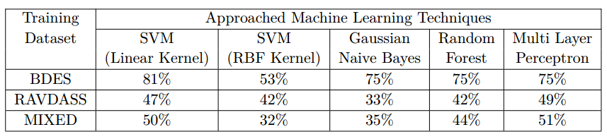
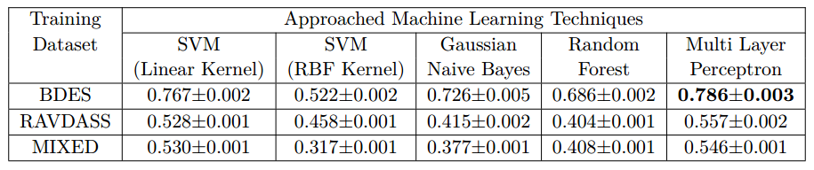

# 🎸 EmoSpeech: Emotion Detection From Audio Signal
In my internship, I've conducted research on audio signal analysis and applied couple of ML algorithms on two well-known dataset for audio emotion detection. 

##  📑 Dataset
Two datasets have been used to train different models.
 - [RAVDESS Dataset](https://zenodo.org/record/1188976#.XQq00LwzZPY)
 - [BERLIN Dataset](http://emodb.bilderbar.info/start.html) 

### 🌴 RAVDESS 
This is an english audio-visual DB created by Steven R.Livingstone and Frank A. Russo. For training, I've created **8** folders each corresponds to specific emotion. The folders contains audio files in following manner:

|Emotional Condition | Samples | 
:------------------:|:--------:|
Neutral | 96 |
Angry | 192 |
Happy | 192 |
Sad | 192 |
Calm | 192 |
Fearful | 192 |
Disgust | 192 |
Surprised | 192 |
  
### 🌴 Berlin DB (BDES)
Berlin dataset contains audio samples in **Deutsch** language. Training samples are labeled as:

Emotional Condition | Samples | 
:------------------:|:--------:|
Neutral | 79 |
Angry | 127 |
Happy | 71 |
Sad | 62 |

## 💫 3D Feature Embedding
✔️ **RAVDESS**: The RAVDESS database is gender balanced consisting of 24 professional actors, vocalizing lexically-matched statements in a neutral North American accent. Speech includes calm, happy, sad, angry, fearful, surprise, and disgust expressions.

|
:----:|
_**Fig 1: 3D Feature Embedding Visualization of the RAVDASS Dataset**_.|

✔️ **Berlin DB (BDES)**: At the Institute for Communication Science of the _Technical University of Berlin_, **Berlin DB** of emotional speech was recorded. This database comprises 10 sentences spoken by 10 actors (5 male and 5 female) who simulated 7 emotional states (neutral, anger, joy, fear, sadness, disgust and boredom) for each of the 10 sentences. The utterances were analyzed with respect to prosodic and segmental features. I've used 4 out of 7 different emotion categories for the training. 

|
:----:|
_**Fig 2: 3D Feature Embedding Visualization of the Berlin (BDES) Dataset**_.|

## 📰 Experimental Set-Up
For evaluating the models, the experiments are conducted on the BDES and RAVDASS dataset (described above). In order to evaluate the cross validation on a larger scale, the mixture of both the dataset have been used into the machine learning models.
The individual BDES dataset contains four classes namely: **Neutral, Sad, Happy and Angry**. RAVDASS dataset contains eight different classes namely: **Neutral, Angry, Calm, Disgust, Fearful, Happy, Sad and Surprised**.

Five different machine learning model settings have been used for evaluation using the dataset described above. They are:
 - SVM with Linear Kernel
 - SVM with RBF Kernel
 - Random Forest with decision tree classifiers
 - Gaussian Naive Bayes
 - Multi Layer Perceptron (MLP)

## 📋 Experimental Results
In this section, the quantitative and qualitative performance of the five models, are presented. Table 1 contains the accuracy of different models on the dataset described above without cross validation. Table 2 contains the accuracy score with 10-fold cross
validation.

|
:---:|
_**Table 1: Accuracy comparison between ML models without cross-validation**_.|

|
:---:|
_**Table 2: Accuracy comparison between ML models with 10-fold cross-validation**_.|

